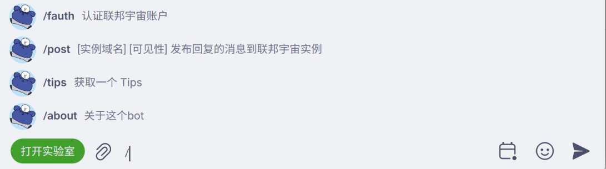

# 命令列表
在 Telegram 端使用 bot，你可以输入 / 来获取当前环境下 bot 能用到的命令，比如：

而在 Matrix 端，你需要发送 !help 命令。
## Telegram 端
::: info
这个表去除了 /start、/help、/about、/ping 等杂项命令。
:::
### 实用命令
| 命令                   | 说明                                                          |
|----------------------|-------------------------------------------------------------|
| /info                | 获取用户id、用户名以及当前聊天的id和用户名                                     |
| /tips                | 从 tips 列表抽取一条发给用户，并在一分钟之后删除它，所有的 tips 列表见 [tips 列表](./tips) |
| /report_broken_links | 回报链接清理的问题，格式为： /report_broken_links 链接 参数说明                 |
| /stats               | （在群组内）获取群组的统计信息，包括总榜、24小时榜等                                 |
| /mc                  | 查询 Minecraft 服务器信息                                          |
### 趣味命令
| 命令                   | 说明                                                 |
|----------------------|----------------------------------------------------|
| /bitflip             | 把回复的消息内的 1 变成 0，0 变成 1，如果出现 0.x 的小数，还会自动转换成 1 与其的差 |
| /t                   | 互赠头衔（bot 需要为管理员，并拥有新增管理员的权限）                       |
| 我是笨蛋                 | 回复“你是笨蛋”                                           |
| /<文本内容> （或 \<文本内容> ） | （在群组内）对回复的群友“执行”<文本内容>对应的动作                        |

其中最后的动作和 /t 可以参考 [kmuabot](https://github.com/krau/kmua-bot/blob/d551f847547a8d97cc33b3c1906803dffe30c921/docs/docs/help.md) 的使用说明，虽然本 bot 还未能支持 /$ 这一类的用法。
