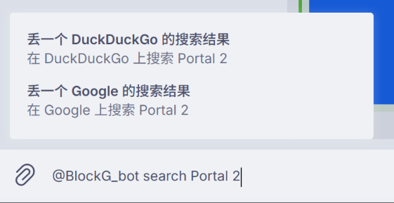

# 在 Inline 模式下使用 bot
bot 不在聊天内时也能提供便利功能，输入 @BlockG_bot 即可唤出：


## search
在后面紧接着输入 `search <搜索词>` 即可快速发送一条含有搜索引擎的链接，比如要搜索《传送门 2》这个游戏：


然后选择其中一个搜索引擎就可以发送类似的消息：

> 我建议你用 DuckDuckGo 搜一下 [Portal 2](https://duckduckgo.com/?q=Portal%202)

::: tip
更多搜索引擎添加中
:::

## pg
在后面接着输入 `pg <要格式化的文本>` 可以使用 [pangu](https://github.com/vinta/pangu.py) 库来将文本中包含的英文、数字等与中文隔开。

## anuo
> 我可能是阿诺，但我是阿诺不太可能

在后面接着输入 `anuo <可能发生但是不太可能发生的事情>` 就会生成类似于“常熟可能举办 DMS，不过常熟举办 DMS 有点不可能”这种迷惑句式。

## 将军：
> ✋😭🤚✋😭🤚✋😭🤚✋😭🤚✋😭🤚✋😭🤚✋😭🤚✋😭🤚✋😭🤚✋😭🤚

恩！情！

在后面接着输入 `将军：<说的话>`，就会生成这样的文本：

```
将军：二楼一定要建在一楼上面

旁边的手下：✍✍✍✍✍✍✍✍✍✍✍
️围观的群众：\o/\o/\o/\o/\o/\o/\o/\o/\o/\o/\o/\o/\o/\o/\o/\o/\o/
```

::: tip
未来可能不需要“：”就能触发了。
:::

## b23
在后面接着输入 `b23 <搜索词>` 就可以在某知名弹幕网站上搜索视频，默认会返回前十个，点击即可发送。

因为其默认的机制，也可以直接输入视频的编号，然后点击发送
