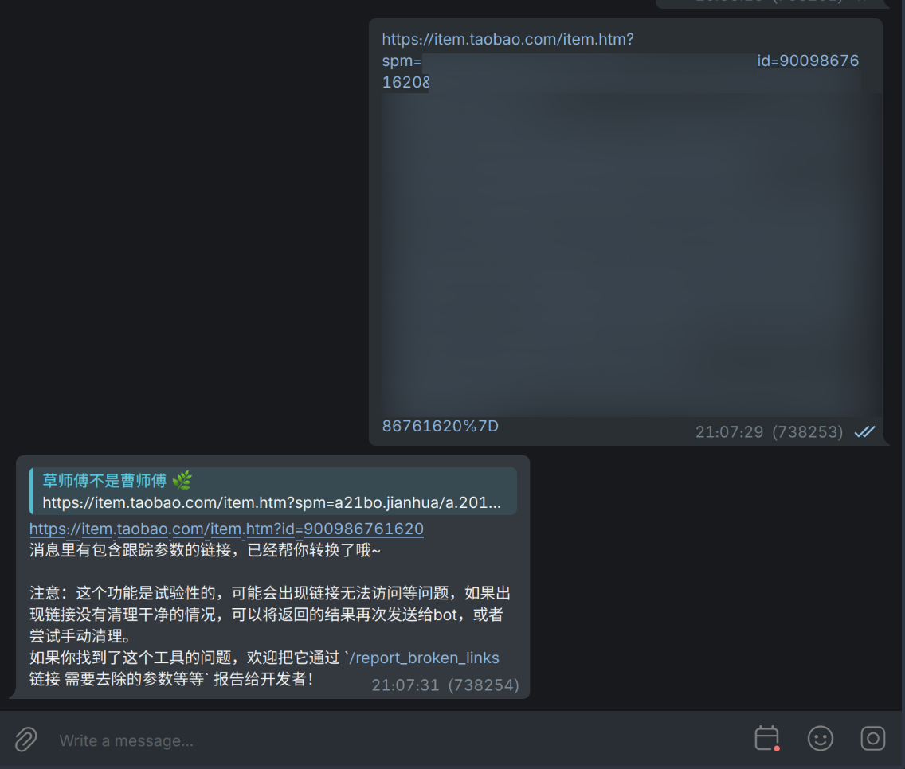
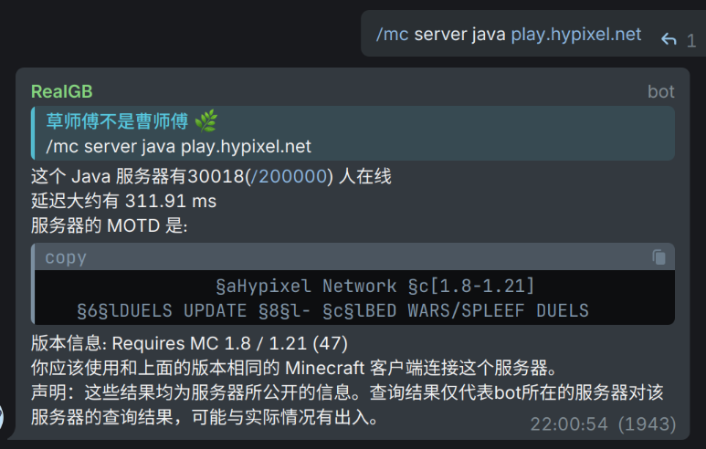
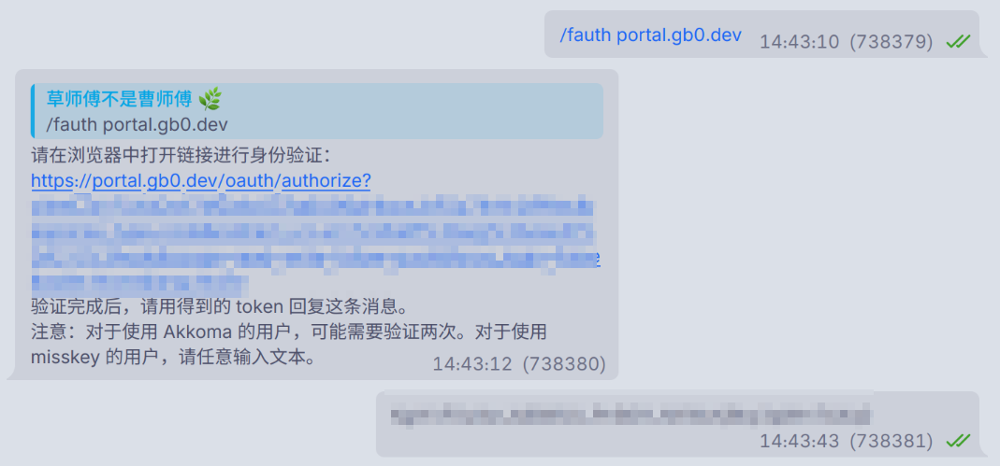

# 其它用法
bot 的除了[命令列表](/commands)中列出的用法以外的用法
## Telegram
### 清理链接


> 清理分享链接的魔法

在 bot 的私聊、未关闭 link 功能的群聊内，发送带跟踪参数的链接，bot 都会尝试清理它的参数。

清理逻辑：

### Minecraft 服务器状态查询


不用打开 Minecraft 就能查询服务器状态。

在未绑定服务器的聊天，比如私聊，可以查询到命令的用法：
```
Usage: /mc <bind/server> <java/bedrock> <server_address>
Example: /mc server java play.example.com
```
比如要查询 java 版的 hypixel 服务器的命令就如上图所示。

当要在某个服务器群绑定一个服务器时，直接使用 `/mc bind <java|bedrock> <服务器地址>`

> [!WARNING]
> 因为bind命令暂未设置仅管理员可用，请在大型群组内小心使用此命令。

### 联邦宇宙互联
> [!WARNING]
> 本 bot 暂时未支持带有格式的消息发送时保留格式、多图发送、保留转发来源

在私聊中使用 `/fauth <账号所在实例的域名>` 来绑定一个联邦宇宙账户（理论上使用 mastodon 风格 api 以及 misskey 风格 api 都支持），一个通常的步骤如下图：


其中 token 是通过认证后实例返回的字符串，请务必妥善保存，以防数据泄露。

认证完成之后对任意一条消息回复 `/post` 就可以把对应的消息转发到联邦宇宙了。

如果出现了认证相关的问题，重新使用 `/fauth` 应当能解决问题。

可以绑定多个 fediverse 账户，只需要在私聊中多次使用 `/fauth` 即可，但在发送帖子时，你需要手动指定实例，比如要使用已经认证的 mastodon.social 的账户：

```text
/post mastodon.social
```

默认使用的可见性是由账户设置决定的，当然也可以手动指定：
```text
/post <direct|private|unlisted|public>
```
可见性取决于实例支持，你很有可能在支持的实例上仅本实例可见的可见性发送这个帖子。

根据 [mastodon.py](https://mastodonpy.readthedocs.io/en/stable/05_statuses.html#mastodon.Mastodon.status_post:~:text=%27direct,timelines,-If) 文档：
```
'direct' - post will be visible only to mentioned users, known in Mastodon’s UI as “Mentioned users only”

'private' - post will be visible only to followers, known in Mastodon’s UI as “Followers only”

'unlisted' - post will be public but will not appear on the public timelines

'public' - post will be public and will appear on public timelines
```

> [!WARNING]
> 由于代码限制，misskey 用户暂时还不能在未指定可见性的情况下以账户默认可见性发送。